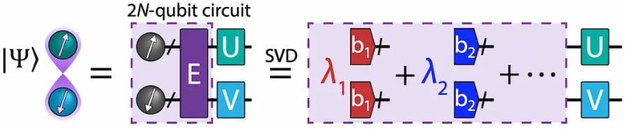

<!-- SHIELDS -->

  
  
  
  
 
  
  

----------------------------------------------------------------------------------------------------

<!-- PROJECT LOGO -->

  <h2 align="center">Entanglement Forging</h2>

  

  

----------------------------------------------------------------------------------------------------

<!-- TABLE OF CONTENTS -->
### Table of Contents
* [Installation](docs/2-reference_guide/reference_guide.md#installation-instructions)
* [Tutorials](docs/1-tutorials/)
* [Background](docs/3-explanatory_material/)
* [How to Give Feedback](#how-to-give-feedback)
* [Contribution Guidelines](#contribution-guidelines)
* [Acknowledgements](#acknowledgements)
* [References](#references)
* [License](#license)
----------------------------------------------------------------------------------------------------

<!-- ABOUT THIS PROJECT -->
### About This Project
This module allows a user to simulate chemical and physical systems using a Variational Quantum Eigensolver (VQE) enhanced by Entanglement Forging [[1]](#references). Entanglement Forging doubles the size of the system that can be *exactly* simulated on a fixed set of quantum bits.

Before using the module for new work, users should read through the [reference guide](./docs/2-reference_guide/reference_guide.md) and the [explanatory material](docs/3-explanatory_material/explanatory_material.md), specifically the [current limitations](docs/3-explanatory_material/explanatory_material.md#%EF%B8%8F-current-limitations) of the module.

----------------------------------------------------------------------------------------------------

<!-- HOW TO GIVE FEEDBACK -->
### How to Give Feedback
We encourage your feedback! You can share your thoughts with us by:
- [Opening an issue](https://github.com/IBM-Quantum-Prototypes/entanglement-forging/issues) in the repository
- [Starting a conversation on GitHub Discussions](https://github.com/IBM-Quantum-Prototypes/entanglement-forging/discussions)
- Filling out our [survey](https://airtable.com/shrFxJXYzjxf5tFvx)

----------------------------------------------------------------------------------------------------

<!-- CONTRIBUTION GUIDELINES -->
### Contribution Guidelines
For information on how to contribute to this project, please take a look at our [CONTRIBUTING.MD](CONTRIBUTING.md) and the [Contribution Guide](https://github.com/IBM-Quantum-Prototypes/docs/2-reference-guide/reference_guide.md#contribution-guide) section of the reference guide.

----------------------------------------------------------------------------------------------------

<!-- ACKNOWLEDGEMENTS -->
### Acknowledgements
This module is based on the theory and experiment described in [[1]](#references).

The initial code on which this module is based was written by Andrew Eddins, Mario Motta, Tanvi Gujarati, and Charles Hadfield. The module was developed by Aggie Branczyk, Iskandar Sitdikov, and Luciano Bello, with help from Caleb Johnson, Mario Motta, Andrew Eddins, Tanvi Gujarati, Stefan Wörner, Max Rossmannek, Ikko Hamamura, and Takashi Imamichi. The documentation was written by Aggie Branczyk, with help from Ieva Liepuoniute, Mario Motta and Travis Scholten.

We also thank Lev Bishop, Sarah Sheldon, and John Lapeyre for useful discussions.

----------------------------------------------------------------------------------------------------

<!-- REFERENCES -->
### References
[1] Andrew Eddins, Mario Motta, Tanvi P. Gujarati, Sergey Bravyi, Antonio Mezzacapo, Charles Hadfield, Sarah Sheldon, *Doubling the size of quantum simulators by entanglement forging*, https://journals.aps.org/prxquantum/abstract/10.1103/PRXQuantum.3.010309

----------------------------------------------------------------------------------------------------

<!-- LICENSE -->
### License
[Apache License 2.0](LICENSE.txt)
